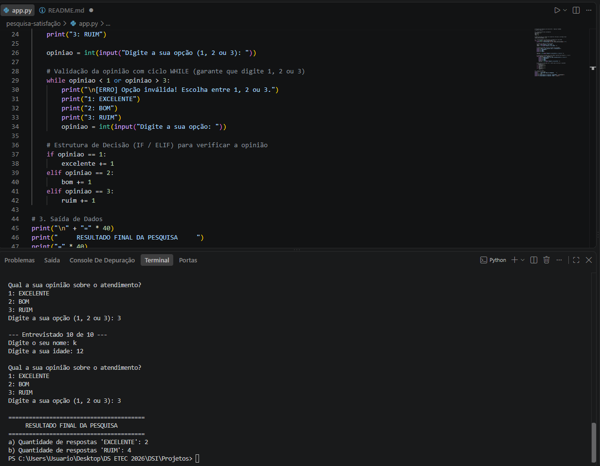

📊 Pesquisa de Satisfação - TudoWeb

🧩 Descrição

Este projeto foi desenvolvido para automatizar a pesquisa de opinião sobre o atendimento prestado pela empresa de marketing TudoWeb.

Ele utiliza estruturas de repetição (for e while) e estruturas condicionais (if/elif) para realizar a coleta de dados de forma contínua e garantir a validação das entradas, seguindo os conceitos apresentados na apostila de Estrutura de Repetição.

🎯 Objetivo

Coletar o nome, a idade e a avaliação de atendimento de uma amostragem de clientes.

Demonstrar o uso de laços de repetição e contadores em Python.

Validar a entrada de dados para aceitar apenas opções válidas.

Exibir a contagem consolidada das avaliações EXCELENTE e RUIM.

⚙️ Funcionalidades

Registro de Clientes: Coleta do nome e idade de cada entrevistado.

Menu Interativo de Avaliação:

1 ➔ EXCELENTE

2 ➔ BOM

3 ➔ RUIM

Validação de Entrada: Impede o avanço do programa até que o usuário digite uma opção válida (1, 2 ou 3).

Contagem Automática: Soma os totais das respostas para a emissão do relatório final.
🚀 Como Executar o Projeto

Certifique-se de ter o Python instalado em sua máquina.

Clone este repositório ou baixe os arquivos:

git clone https://github.com/SEU_USUARIO/SEU_REPOSITORIO.git

📸 Evidências de Execução (Prints)
